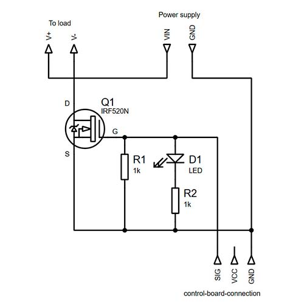

# Модуль на транзисторе IRF520N
[На главную](../../../../README.md)
___
## Внешний вид

## Основные характеристики
- Транзистор: IRF520N
- Напряжение питания (управления): 3,3 VDC и 5 VDC
- Выходное напряжение: 0 … 24 VDC
- Выходной ток: 5 A
- Размеры модуля: 33 мм х 24 мм
__ПРИМЕЧАННИЕ:__ при работе с током выше 1 А, необходимо установить радиатор.

## Электрическая принципиальная схема

## Ссылки
- [Документация с сайта производителя](https://www.infineon.com/cms/en/product/power/mosfet/n-channel/irf520n/#!documents)
- Часть характеристик модуля была взята здесь: [ba3ar.kz](https://ba3ar.kz/product/modul-irf520-silovoj-klyuch-s-polevym-tranzistorom/)