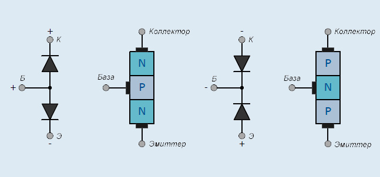
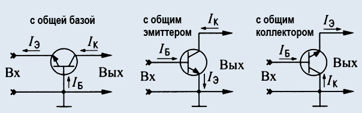

# Биполярные транзисторы
[На главную](../../../../README.md)
[Транзисторы](../transistors.md)
___
__Биполя́рный транзи́стор__ — трёхэлектродный полупроводниковый прибор, один из типов транзисторов. В полупроводниковой структуре сформированы два p-n-перехода, перенос заряда через которые осуществляется носителями двух полярностей — электронами и дырками. Именно поэтому прибор получил название «биполярный» (от англ. bipolar), в отличие от полевого (униполярного) транзистора.

Применяется в электронных устройствах для усиления или генерации электрических колебаний, а также в качестве коммутирующего элемента (например, в схемах ТТЛ).
___
- [Статья на eandc.ru](https://eandc.ru/news/detail.php?ID=21477)

Основной функцией биполярного транзистора (БТ) является увеличение мощности входного электрического сигнала. Эти полупроводниковые радиокомпоненты появились, как альтернатива электровакуумных триодов, и со временем практически вытеснили их из отрасли. Справедливости ради заметим, что лампы применяются и до сих пор, но в очень и очень узком сегменте аппаратуры специального назначения. В массовой же радиотехнике используются, в основном, транзисторы – биполярные и их ближайшие «родственники» полевые.

Ключевое преимущество этих элементов состоит в миниатюрности. Электровакуумный усилитель со схожими характеристиками оказывается в несколько раз крупнее биполярного транзистора. Вследствие этого применение БТ в радиоэлектронике приводит к существенному уменьшению габаритных размеров конечной радиотехнической продукции.

Биполярным данный транзистор называется из-за того, что в физических процессах, протекающих во время его функционирования, участвуют оба типа носителей заряда – и электроны, и дырки. Это оказывает влияние на принцип управления выходным сигналом. В биполярных транзисторах выходными параметрами управляет ток, а не электрическое поле, как в полевых (униполярных).

## Устройство биполярного транзистора

Этот полупроводниковый триод состоит из 3 частей – эмиттера, коллектора и базы. Таким образом, ключевыми элементами биполярного транзистора являются два p-n-перехода, а не один, как в полевых. Эмиттер исполняет функцию генератора носителей заряда, которые формируют рабочий ток, стекающий в приёмник – коллектор. База необходима для подачи управляющего напряжения.

Если рассматривать плоскую модель БТ, то радиокомпонент представляет собой две области с p- или n-проводимостью (эмиттер и коллектор), разделённые тонким слоем полупроводника с проводимостью обратного знака (база). Полупроводниковый кристалл со стороны коллектора физически крупнее. Такое соотношение обеспечивает правильную работу биполярного транзистора.

В зависимости от типа проводимости эмиттера, коллектора и базы различают PNP- и NPN-транзисторы. В принципе, они функционируют одинаково с той лишь разницей, что к ним прикладываются напряжения разной полярности. Выбор того или иного вида БТ определяется особенностями конкретных радиотехнических устройств.

## Принцип работы биполярного транзистора
При подключении эмиттера и коллектора к источнику питания создаются почти все условия для протекания тока. Однако свободному перемещению носителей заряда препятствует база, и для устранения этой помехи на неё подаётся напряжение смещения. В базовом слое полупроводника возникают физико-химические процессы электронно-дырочной рекомбинации, в результате которой через базу начинает течь небольшой ток. В результате p-n-переходы открывают путь потоку носителей заряда от эмиттера к коллектору.

Если ток, протекающий через базу, меняется по какому-то закону, то точно так же изменяется и мощный ток между эмиттером и коллектором. Следовательно, мы получаем на выходе биполярного транзистора такой же сигнал, как и на базе, но с более высокой мощностью. В этом и состоит усилительная функция биполярного транзистора.

## Режимы работы
Существует 4 режима, в одном из которых может работать биполярный транзистор. В этот список входят следующие:
1. отсечка;
2. активный режим;
3. насыщение;
4. барьерный режим.
Существует ещё так называемый инверсный режим, но он на практике не используется и интересен только при теоретических исследованиях поведения полупроводников. Поэтому опишем подробнее только четыре первых.

### 1. Отсечка
В том случае, если разность потенциалов между эмиттером и базой ниже некоторого значения (примерно 0.6 Вольт), то база-эмиттерный p-n-переход оказывается закрытым, поскольку ток базы не возникает. В связи с этим коллекторный ток не протекает по той причине, что в базовом слое отсутствуют свободные электроны. Таким образом, транзистор переходит в состояние отсечки и сигнал не усиливает. Этот режим используется в цифровых схемах, когда БТ работает как ключ в положении «разомкнуто».

### 2. Активный режим
В этом режиме радиокомпонент усиливает сигнал, то есть исполняет свою основную функцию. На базу подаётся разность потенциалов, которая открывает база-эмиттерный p-n-переход. Как следствие, в транзисторе начинают протекать токи коллектора и базы. Значение коллекторного тока вычисляется как арифметическое произведение величины тока базы и коэффициента усиления.

### 3. Насыщение
В этот режим биполярный транзистор входит при увеличении тока базы до некоего предельного значения, при котором p-n-переходы полностью открываются. Значение тока, протекающего через БТ при его насыщении, зависит лишь от питающего напряжения и величины нагрузки в коллекторной цепи. В данном режиме входной сигнал не усиливается, ведь коллекторный ток не воспринимает изменений тока базы. Способность транзистора к переходу в насыщение используется в цифровой технике, когда БТ играет роль ключа в замкнутом положении.

### 4. Барьерный режим
Здесь транзистор работает как диод с последовательно включённым резистором. Для этого базу напрямую или через малоомное сопротивление соединяют с коллектором. В данном режиме триоды хорошо показывают себя в высокочастотных устройствах. Кроме того, использование транзистора в барьерном режиме целесообразно на реальном производстве для снижения общего количества комплектующих.

## Схемы включения биполярных транзисторов

Полупроводниковый триод может включаться в электрическую цепь по одной из трёх схем – с общим эмиттером, с общим коллектором и с общей базой. В зависимости от способа подключения различаются электрические параметры транзистора, что определяет выбор схемы в каждом конкретном случае.

При включении биполярного транзистора с общим эмиттером достигается максимальное усиление входного сигнала. Благодаря этому данная схема в усилительных каскадах применяется чаще всего.

Схема с общим коллектором по-другому называется эмиттерным повторителем. Это связано с тем, что разность потенциалов на коллекторе и эмиттере оказываются практически равными. При таком включении наблюдаются большое усиление по току, высокое входное сопротивление и совпадение фаз входного и выходного сигналов. Вследствие этого эмиттерные повторители используются в согласующих и буферных усилителях.

При включении БТ по схеме с общей базой отсутствует усиление по току, но значительным оказывается усиление по напряжению. Особенностью данного способа является малое влияние транзистора на сигналы высокой частоты. Это делает схему с общей базой предпочтительной для использования в устройствах СВЧ.

## Основные параметры биполярных транзисторов:
1. Максимально допустимый постоянный ток коллектора;
2. Максимальное напряжение между коллектором и эмиттером при заданном токе коллектора и сопротивлении в цепи база-эмиттер;
3. Максимальное напряжение между коллектором и эмиттером при заданном токе коллектора и токе базы, равным нулю;
4. Максимальное напряжение коллектор-база при заданном токе коллектора и токе эмиттера, равным нулю;
5. Максимально допустимое постоянное напряжение эмиттер-база при токе коллектора, равном нулю;
6. Максимально допустимая постоянная мощность, рассеивающаяся на коллекторе;
7. Статический коэффициент передачи тока;
8. Напряжение насыщения между коллектором и эмиттером;
9. Обратный ток коллектора. Ток через коллекторный переход при заданном обратном напряжении коллектор-база и разомкнутом выводе эмиттера;
10. Обратный ток эмиттера. Ток через эмиттерный переход при заданном обратном напряжении эмиттер-база и разомкнутом выводе коллектора;
11. Граничная частота коэффициента передачи тока;
12. Коэффициент шума;
13. Емкость коллекторного перехода;
14. Максимально допустимая температура перехода.