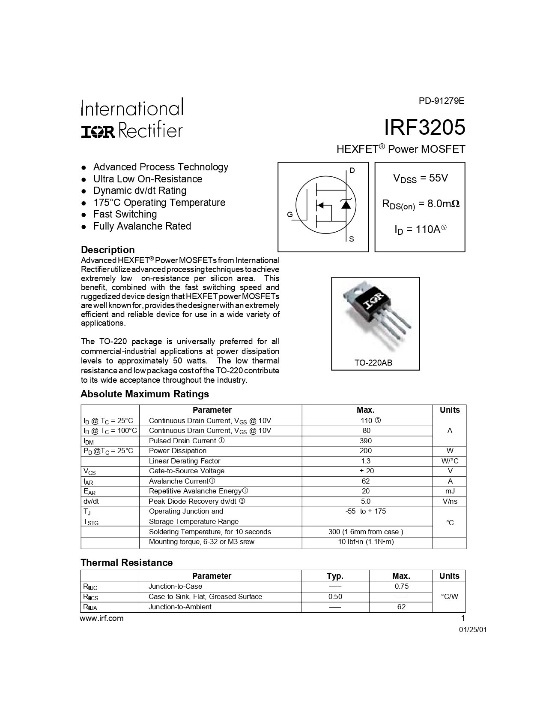
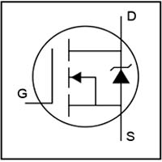
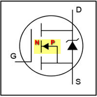
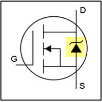
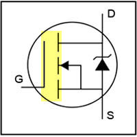
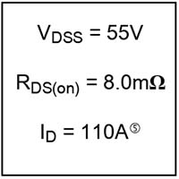

# Расшифровка даташита на примере полевого транзистора IRF3205
[На главную](../../../../../README.md../../../README.md)
[MOSFET](../mosfet.md)
[Транзисторы](../../transistors.md)
___
## Страница 1

### Расшифровка страницы 1
__IRF3205__ - название транзистора.
- __HEXFET__
    - В семействе полевых транзисторов есть отдельная группа мощных полупроводниковых приборов называемых __HEXFET__. Их принцип работы основан на весьма оригинальном техническом решении. Их структура представляет собой несколько тысяч МОП ячеек включенных параллельно.

    - Ячеистые структуры образуют шестиугольник. Из-за шестиугольной или по-другому гексагональной структуры данный тип мощных МОП-транзисторов и называют __HEXFET__. Первые три буквы этой аббревиатуры взяты от английского слова __hexagonal__ – «__гексагональный__».

__Power MOSFET__ - силовой MOSFET (полевой) транзистор.

#### Схема транзистора

- Где
    - G - Gate - Затвор
    - D - Drain - Сток
    - S - Source - Исток

##### Обозначение перехода, структуры транзистора

- Стрелка указыывает направление P-N перехода. В случае транзистора IRF3205, транзистор имеет структуру P-N-P.

##### Диод в составе транзистора

- Выделенное обозначение, является обозначением диода, который находится внутри корпуса транзистора. На схеме видно направление и подключение диода.

##### Изолированный затвор

- Выделенная область, является обозначением изолированного затвора.

#### Основные параметры транзистора

- __VDSS__ (55V) - напряжение между стоком __D__ и истоком __S__.
- __RDS(on)__ (8.0mΩ) - сопротивление между стоком __D__ и истоком __S__. Чем сопротивление меьше, тем меньше будет нагреваться транзистор в импульсных и переключающих схемах.
- __ID__ (110A) - ток стока. Это рабочий ток транзистора.

## Полезные ссылки. Источники
- [Параметры MOSFET транзисторов](https://go-radio.ru/parametri-mosfet-transistorov.html)